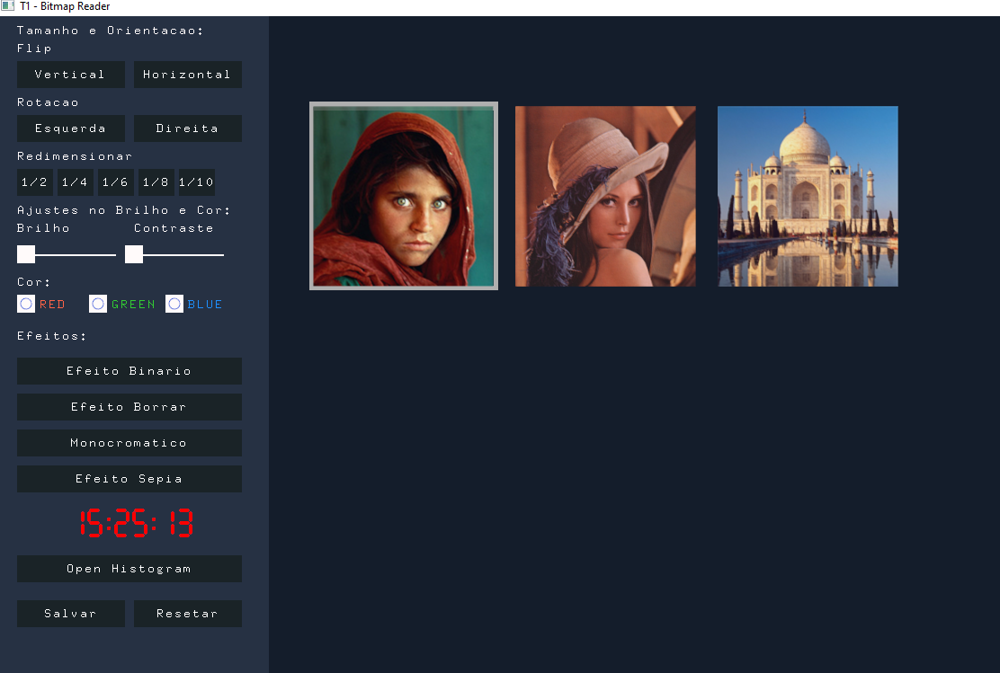

# Render Bitmap

    

## Descrição:
O projeto é um leitor/editor de imagens do tipo BITMAP feito no canvas2d que você poderá 
mudar o contraste, brilho, rotação, orientação, escala e aplicar efeitos a uma imagem bitmap,
também pode-se ver um histograma da imagem que esta sendo manipulada no momento das alterações.
A aplicação é bem simples e rudimentar sendo assim longe de algo profissional para uso e com muitas 
melhorias e ajustes a serem feitos.  

## Manual de Uso:
Basta abrir a aplicação executar o main junto com as bibliotecas necessárias
para rodar o canvas2d. Caso queira usar outras imagens na aplicação basta
inserir três imagem na pasta resources do projeto o ir no arquivo config.cpp
do projeto e na função Config::Config() ou linhas 34-36 e alterar os nomes
das imagens conforme necessário.
O canal de luminância no histograma só fica ativo se o botão do efeito binário
for clicado.
Caso ele não encontre o diretório pode-se mudar também na classe Utils.cpp na linha
40 e 43 da função getImagePath.

Ex.: 34 img = new Bitmap(Utils::getImagePath("img1.bmp"));

## Implementações:

### Básico:
- [X] Carregar imagens colorida (RGB) em formato BMP.
- [X] Mover cada imagem individualmente dentro da canvas2D com uso do mouse.
- [X] Exibir as imagens de várias forma:
  - [X] Original.
  - [X] Em canais separados RGB.
  - [X] Em tons de cinza (luminância).
- [X] Rotacionar a imagem no eixo vertical e horizontal (flip).
- [X] Plotar o histograma de cada canal RGB e da luminância.
- [X] Escalar a imagem 1/2, 1/4, rtc.

### Extras:
- [X] Barra de slider.
- [X] Botão de checkbox.
- [X] Display de 7 segmentos apresentando a hora.
- [X] Efeito Monocromático, Sepia e Blur.
- [X] Poder salvar a imagem.
- [X] Hover nos botôes.

## Melhorias a fazer:
- [ ] Ao trocar de imagem os valores do slider e não seguem o atual da imagem.
- [ ] Ao aplicar o brilho e o contraste preciso fazer ajuste nos níveis, e ao aplicá-los
em uma imagem rotacionada ele coloca na a imagem de volta a posição original. Preciso dar
mais uma estudada em manipulação de imagens.
